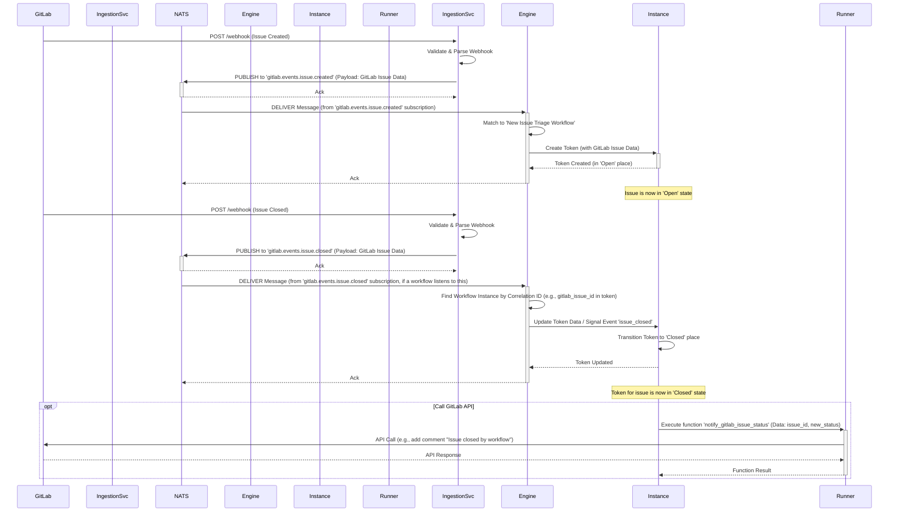
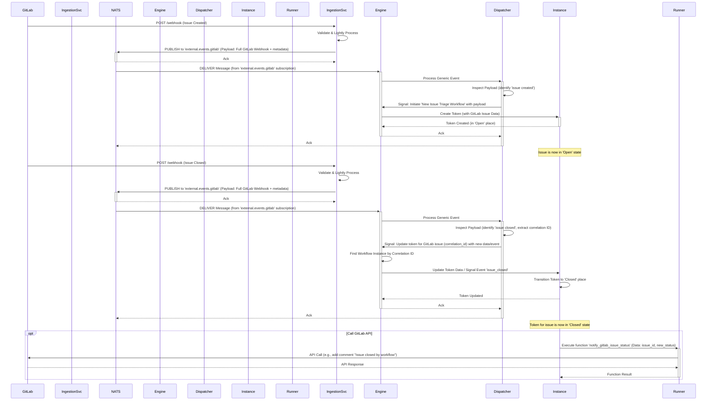

# Webhook Integration Patterns for Circuit Breaker

This document explores two primary architectural patterns for integrating external webhook events (e.g., from GitLab, GitHub, Stripe, etc.) with the Circuit Breaker workflow engine, focusing on the use of NATS subjects as event triggers.

## Introduction

When third-party systems emit events via webhooks, our workflow engine needs a way to:
1. Receive these HTTP-based webhook calls.
2. Transform them into internal events.
3. Trigger or update relevant workflow instances.

The key difference in the patterns below lies in how NATS subjects are utilized for step 2 and 3.

## Pattern 1: Specific NATS Subjects per Event Type

### Description

In this pattern, a **Webhook Ingestion Service** is responsible for receiving HTTP webhooks, parsing them to understand the specific event type from the source system, and then publishing a message to a **granular NATS subject** that directly corresponds to that event type.

Workflow definitions then subscribe to these specific NATS subjects to get triggered.

**Example NATS Subjects (Published by Ingestion Service):**
- `gitlab.events.issue.created`
- `gitlab.events.issue.updated`
- `gitlab.events.issue.closed`
- `gitlab.events.mergerequest.opened`
- `stripe.events.invoice.paid`

### Workflow Definition

A workflow definition would declare a specific NATS subject as its trigger:

```json
// Example: New Issue Triage Workflow Definition
{
  "name": "New Issue Triage Workflow",
  "trigger": {
    "type": "NATS_SUBJECT",
    "subject": "gitlab.events.issue.created" // Specific subject
  },
  "initial_token_data_source": "trigger_event_payload",
  // ... places, transitions, etc.
}
```

### Message Flow (Sequence Diagram)



## Pattern 2: Generic NATS Subject with Internal Dispatch

### Description

In this pattern, the **Webhook Ingestion Service** publishes all webhooks from a particular source (or even all webhooks globally) to a **single, generic NATS subject**.

The **Workflow Engine** itself then subscribes to this generic subject. An "Event Processor/Dispatcher" component within the engine inspects the payload of each incoming message to determine the actual event type and decides which workflow to trigger or which existing token to update.

**Example NATS Subject (Published by Ingestion Service):**
- `external.events.gitlab` (all GitLab events)
- Or even more generic: `external.webhooks.raw` (all webhooks from any source)

The message payload would contain the raw webhook data and necessary metadata (e.g., `source: "gitlab"`, `event_type_header: "Issue Hook"`).

### Workflow Definition

Workflow definitions might not have an explicit NATS subject trigger. Instead, the engine's internal dispatcher configuration would map incoming generic events to workflow definitions. Alternatively, a workflow could "subscribe" to an *internal* event name that the dispatcher emits.

```json
// Example: New Issue Triage Workflow Definition
{
  "name": "New Issue Triage Workflow",
  "trigger": {
    "type": "INTERNAL_EVENT", // Or configured in a central dispatcher
    "event_name": "gitlab_issue_created_event"
  },
  "initial_token_data_source": "trigger_event_payload",
  // ... places, transitions, etc.
}
```

### Message Flow (Sequence Diagram)



## Comparison of Patterns

| Feature                    | Pattern 1: Specific NATS Subjects | Pattern 2: Generic NATS Subject             |
| -------------------------- | --------------------------------- | ------------------------------------------- |
| **NATS Subject Granularity** | High (e.g., `gitlab.events.issue.created`) | Low (e.g., `external.events.gitlab`)        |
| **Webhook Ingestion Svc Logic** | More complex: Parses event type, maps to specific NATS subject. | Simpler: Publishes raw/lightly processed data to one subject. |
| **Workflow Engine Logic**  | Simpler: Subscribes directly to specific event subjects. | More complex: Needs an Event Processor/Dispatcher to inspect payloads and route to workflows. |
| **Adding New Event Types** | 1. Update Ingestion Service config/code to publish to new specific NATS subject. <br> 2. New/updated workflow definitions subscribe to this new subject. <br> *No engine code change.* | 1. Update Event Processor/Dispatcher logic/config within the Workflow Engine to recognize and map the new event type from the generic stream. <br> *Engine configuration/logic changes.* |
| **Decoupling**             | High between Ingestion Service and Workflow Engine. Engine doesn't need to parse raw events. | Moderate. Engine is coupled to the structure of raw events in the generic stream. Ingestion Service is highly decoupled. |
| **NATS Traffic**           | Potentially more NATS subjects, but workflows only receive relevant messages. | Fewer NATS subjects, but the engine's generic subscriber receives *all* events from that source and filters internally. |
| **Troubleshooting**        | Easier to see event flow in NATS if a specific subject isn't being processed. Typos in workflow definitions' `subject` field can be an issue. | Harder to trace a specific external event type in NATS alone. Debugging relies more on logs within the Event Processor/Dispatcher. |
| **Flexibility for Engine** | Less flexible for the engine to dynamically react to unforeseen event types without new subscriptions. | More flexible for the engine to handle new event types if the dispatcher logic is data-driven or easily configurable. |
| **Brittleness**            | Workflow definitions subscribing to mistyped NATS subjects can be hard to debug. Requires careful NATS subject management. | Central dispatcher logic can become a complex bottleneck if not well-designed. Potential for errors in payload inspection. |
| **Discoverability**        | NATS subjects clearly indicate the types of events flowing. | Less obvious from NATS subjects alone; payload inspection is key. |
| **Security Isolation**     | Better - each event type isolated to specific subjects | Moderate - all events on same subject |
| **Resource Usage**         | Higher NATS subject count, targeted consumers | Lower subject count, single consumer processes all |
| **Deployment Complexity**  | Moderate - need to manage subject mappings | Lower - single subscription point |
| **Testing Strategy**       | Easier - can test specific event types in isolation | Harder - need to test dispatcher logic |
| **Monitoring Granularity** | High - can monitor each event type separately | Lower - need to parse logs to understand event types |

## End-User Workflow Definition and Engine Integration

Regardless of the pattern chosen for NATS subject handling, the end-user experience of defining workflows that react to these external events should be as consistent and intuitive as possible, leveraging the existing Circuit Breaker engine capabilities.

### Core Concepts for User-Defined Workflows:

1.  **Trigger Definition:** How a workflow specifies it should be initiated by an external event.
2.  **Data Ingestion:** How the payload from the webhook (now a NATS message) is mapped into the initial `Token` of the workflow instance.
3.  **Correlation:** For events that update existing workflow instances, how the incoming event is matched to the correct active token.
4.  **Subsequent Actions:** How the workflow uses the ingested data to drive Agents or Functions.

### Pattern 1: Specific NATS Subjects

#### Workflow Definition:
A user defines a workflow (e.g., in JSON or YAML format) and specifies a NATS subject as a trigger.

```json
{
  "id": "gitlab_new_issue_triage",
  "name": "GitLab New Issue Triage",
  "description": "Handles new issues created in GitLab.",
  "initial_place": "new_issue_received",
  "trigger": {
    "type": "NATS_MESSAGE", // Or a more specific type like "EXTERNAL_NATS_EVENT"
    "config": {
      "subject": "gitlab.events.issue.created",
      // Optionally, specify how to extract a correlation ID if this event might update existing tokens
      // "correlation_id_path": "payload.issue.iid" 
    }
  },
  "token_schema": { // Defines the expected structure of the token's data
    "initial_data_mapping": {
      // Maps fields from the NATS message payload (webhook data) to the token's data
      "gitlab_issue_id": "payload.issue.id",
      "gitlab_issue_iid": "payload.issue.iid", // Internal ID for project
      "project_id": "payload.project.id",
      "title": "payload.issue.title",
      "description": "payload.issue.description",
      "author": "payload.user.username",
      "labels": "payload.labels[*].title",
      "raw_event": "payload" // Store the whole event if needed
    }
  },
  "places": [
    {"id": "new_issue_received", "name": "New Issue Received"},
    {"id": "assign_priority", "name": "Assign Priority (AI Agent)"},
    {"id": "notify_team", "name": "Notify Team (Function)"},
    {"id": "closed", "name": "Closed"}
  ],
  "transitions": [
    {
      "id": "process_new_issue",
      "from_places": ["new_issue_received"],
      "to_place": "assign_priority",
      // This transition might use an Agent (see AGENT_CONFIGURATION.md)
      "agent_execution": { 
        "agent_id": "ai_issue_prioritizer",
        "input_mapping": { // Data from token to agent
            "issue_title": "data.title",
            "issue_description": "data.description"
        },
        "output_mapping": { // Data from agent back to token
            "data.ai_priority": "priority_level",
            "data.ai_summary": "summary"
        }
      }
    },
    {
      "id": "priority_assigned_notify",
      "from_places": ["assign_priority"],
      "to_place": "notify_team"
      // This transition could trigger a Function (see FUNCTION_RUNNER.md)
      // The FunctionRunner would be configured with a FunctionDefinition that listens to
      // an internal event like "token_entered_place:assign_priority" or "token_transitioned:process_new_issue"
      // Or, the transition itself could directly specify a function to run.
    }
    // ... other transitions for issue updates (e.g., based on 'gitlab.events.issue.updated')
    // that would find the existing token via 'gitlab_issue_id' and apply changes.
  ]
}
```

#### Engine Integration (Mapping to Rust Implementation):

Integrating this pattern into the Rust-based Circuit Breaker engine would involve extending or utilizing several existing concepts:

1.  **WorkflowDefinition Struct Modification:**
    The Rust struct representing a workflow definition (let's assume `WorkflowDefinition`) would need to incorporate the trigger configuration.

    ```rust
    // Potential Rust struct representation
    // (This would likely live in your models or engine crate)
    use std::collections::HashMap;
    use serde::{Deserialize, Serialize};
    use uuid::Uuid; // Assuming you use UUIDs for IDs

    #[derive(Debug, Clone, Serialize, Deserialize)]
    pub struct WorkflowDefinition {
        pub id: String, // e.g., "gitlab_new_issue_triage"
        pub name: String,
        pub description: Option<String>,
        pub version: String, // e.g., "v1.2.3"
        pub initial_place: String, // e.g., "new_issue_received"
        pub trigger: Option<TriggerConfig>,
        // Defines how to map NATS message payload to initial token data
        // Key: path in token data (e.g., "data.gitlab_issue_id")
        // Value: path in NATS message payload (e.g., "payload.issue.id")
        pub initial_token_data_mapping: Option<HashMap<String, String>>,
        // Version management and migration
        pub migration_rules: Option<Vec<MigrationRule>>,
        pub backward_compatibility: Option<CompatibilityConfig>,
        // Security and access control
        pub security_config: Option<SecurityConfig>,
        // ... other fields like places, transitions as already defined ...
    }

    #[derive(Debug, Clone, Serialize, Deserialize)]
    pub struct MigrationRule {
        pub from_version: String,
        pub to_version: String,
        pub migration_strategy: MigrationStrategy,
        pub token_transformations: Vec<TokenTransformation>,
    }

    #[derive(Debug, Clone, Serialize, Deserialize)]
    pub enum MigrationStrategy {
        InPlace,      // Migrate tokens without creating new instances
        NewInstance,  // Create new workflow instances for existing tokens
        Manual,       // Require manual intervention
    }

    #[derive(Debug, Clone, Serialize, Deserialize)]
    pub struct TokenTransformation {
        pub field_path: String,
        pub transformation_type: TransformationType,
        pub parameters: HashMap<String, serde_json::Value>,
    }

    #[derive(Debug, Clone, Serialize, Deserialize)]
    pub enum TransformationType {
        Rename,
        Delete,
        AddDefault,
        Transform, // Custom transformation function
    }

    #[derive(Debug, Clone, Serialize, Deserialize)]
    pub struct CompatibilityConfig {
        pub supported_versions: Vec<String>,
        pub deprecation_warnings: bool,
        pub strict_mode: bool,
    }

    #[derive(Debug, Clone, Serialize, Deserialize)]
    pub struct SecurityConfig {
        pub required_permissions: Vec<String>,
        pub data_classification: DataClassification,
        pub encryption_required: bool,
        pub audit_level: AuditLevel,
    }

    #[derive(Debug, Clone, Serialize, Deserialize)]
    pub enum DataClassification {
        Public,
        Internal,
        Confidential,
        Restricted,
    }

    #[derive(Debug, Clone, Serialize, Deserialize)]
    pub enum AuditLevel {
        None,
        Basic,
        Detailed,
        Full,
    }

    #[derive(Debug, Clone, Serialize, Deserialize)]
    pub enum TriggerType {
        NatsMessage,
        // Potentially others like Manual, Scheduled, etc.
    }

    #[derive(Debug, Clone, Serialize, Deserialize)]
    pub struct TriggerConfig {
        pub trigger_type: TriggerType, // Renamed from "type" to avoid keyword clash
        pub config: TriggerSpecificConfig,
        pub filters: Option<Vec<EventFilter>>, // Filter events before processing
        pub rate_limiting: Option<RateLimitConfig>,
    }

    #[derive(Debug, Clone, Serialize, Deserialize)]
    pub enum TriggerSpecificConfig {
        NatsMessage(NatsMessageTriggerConfig),
        InternalEvent(InternalEventTriggerConfig),
        Schedule(ScheduleTriggerConfig), // For time-based triggers
        Manual(ManualTriggerConfig),     // For API-triggered workflows
    }

    #[derive(Debug, Clone, Serialize, Deserialize)]
    pub struct InternalEventTriggerConfig {
        pub event_name: String,
        pub correlation_id_path_in_event: Option<String>,
        pub correlation_id_field_in_token: Option<String>,
        pub action_type: TriggerActionType,
    }

    #[derive(Debug, Clone, Serialize, Deserialize)]
    pub struct ScheduleTriggerConfig {
        pub cron_expression: String,
        pub timezone: String,
        pub max_instances: Option<u32>,
    }

    #[derive(Debug, Clone, Serialize, Deserialize)]
    pub struct ManualTriggerConfig {
        pub required_permissions: Vec<String>,
        pub input_schema: Option<serde_json::Value>,
    }

    #[derive(Debug, Clone, Serialize, Deserialize)]
    pub struct NatsMessageTriggerConfig {
        pub subject: String,
        // Path to extract a correlation ID from the NATS message payload.
        // Used for events that update existing tokens.
        // e.g., "payload.issue.id" to find a token linked to that GitLab issue.
        pub correlation_id_path_in_payload: Option<String>,
        // Field name in the token's metadata where the correlation ID is stored.
        // e.g., "gitlab_issue_id"
        pub correlation_id_field_in_token: Option<String>,
        // Defines if this trigger should create a new workflow instance
        // or update an existing one. Could be an enum: CreateNew, UpdateExisting, CreateOrUpdate.
        pub action_type: TriggerActionType,
        // Error handling and recovery configuration
        pub retry_config: Option<RetryConfig>,
        pub dead_letter_queue: Option<String>, // Subject for failed messages
        pub max_processing_time: Option<Duration>,
        // Event filtering to reduce unnecessary processing
        pub filters: Option<Vec<EventFilter>>,
        // Rate limiting configuration
        pub rate_limiting: Option<RateLimitConfig>,
    }

    #[derive(Debug, Clone, Serialize, Deserialize)]
    pub struct RetryConfig {
        pub max_attempts: u32,
        pub backoff_strategy: BackoffStrategy,
        pub retry_delay_seconds: u64,
        pub retry_on_errors: Vec<String>, // Error types to retry on
    }

    #[derive(Debug, Clone, Serialize, Deserialize)]
    pub enum BackoffStrategy {
        Fixed,
        Linear,
        Exponential { multiplier: f32 },
    }

    #[derive(Debug, Clone, Serialize, Deserialize)]
    pub struct EventFilter {
        pub field_path: String,    // e.g., "payload.issue.labels[*].name"
        pub operator: FilterOperator, // Contains, Equals, GreaterThan, etc.
        pub value: serde_json::Value,
    }

    #[derive(Debug, Clone, Serialize, Deserialize)]
    pub enum FilterOperator {
        Equals,
        NotEquals,
        Contains,
        NotContains,
        GreaterThan,
        LessThan,
        Exists,
        NotExists,
    }

    #[derive(Debug, Clone, Serialize, Deserialize)]
    pub struct RateLimitConfig {
        pub max_events_per_minute: u32,
        pub burst_allowance: u32,
        pub backoff_on_limit: bool,
    }

    #[derive(Debug, Clone, Serialize, Deserialize, PartialEq)]
    pub enum TriggerActionType {
        CreateNewInstance,
        UpdateExistingInstance,
        // Potentially CreateOrUpdate
    }
    ```

2.  **Workflow Engine Core Logic:**
    *   **Loading Definitions:** The main engine service/daemon would load all `WorkflowDefinition`s (e.g., from JSON/YAML files, a database, or a configuration service).
    *   **Trigger Management Service:** A dedicated component, possibly interacting closely with the `NATSStorage` system (see `NATS_IMPLEMENTATION.md` and `NATS_TIMING_IMPROVEMENTS.md`), would be responsible for:
        *   Iterating through all loaded `WorkflowDefinition`s.
        *   For each definition with a `TriggerConfig` of `TriggerType::NatsMessage`:
            *   Using the NATS client (from `NATSStorage` or a shared NATS connection pool), subscribe to the `subject` specified in `NatsMessageTriggerConfig`.

3.  **NATS Message Handling:**
    *   When a message is received on a subscribed NATS subject:
        *   The Trigger Management Service (or a handler it invokes) identifies the `WorkflowDefinition(s)` associated with this subject.
        *   It deserializes the NATS message payload (which is the webhook data).
        *   **If `action_type` is `CreateNewInstance`:**
            *   A new `Token` is created.
            *   The `initial_token_data_mapping` from the `WorkflowDefinition` is used to extract values from the NATS message payload and populate the new token's `data` and/or `metadata` fields. This involves parsing dot-separated paths (e.g., `payload.issue.id`).
            *   The new token is placed in the `initial_place` of the workflow.
            *   `NATSStorage::create_token_with_event` (or a similar method that also handles initial NATS record creation for the token as per `NATS_TIMING_IMPROVEMENTS.md`) is called to persist the token.
        *   **If `action_type` is `UpdateExistingInstance`:**
            *   The `correlation_id_path_in_payload` is used to extract the correlation value from the NATS message payload.
            *   The `correlation_id_field_in_token` specifies which metadata field in stored tokens holds this correlation value.
            *   The engine queries `NATSStorage` to find the active token. This might involve a new method in `NATSStorage`, e.g., `find_active_token_by_metadata(workflow_id: &str, metadata_field: &str, metadata_value: &serde_json::Value) -> Result<Option<Token>>`. The refined NATS subject structure (`cb.workflows.{workflow_id}.places.*.tokens.{token_id}`) is essential for efficient lookups if the `token_id` can be derived or if metadata queries are supported by NATS JetStream's filtering.
            *   If a token is found, its `data` and/or `metadata` are updated based on the NATS message payload (potentially using a separate `update_token_data_mapping` in the `WorkflowDefinition`).
            *   The `NATSStorage` would then update the token (e.g., by republishing it to its current subject, ensuring NATS sequence and timestamp are correctly handled).
            *   The `RulesEngine` (see `RULES_ENGINE.md`) would then be consulted to see if this update triggers any transitions from the token's current place.

        4.  **Token State, Transitions, and Updates via NATS Subjects:**
            This part details how a token's representation in NATS changes as it moves through a workflow and how external updates are handled, aligning with the storage patterns in `NATS_IMPLEMENTATION.md` and particularly `NATS_TIMING_IMPROVEMENTS.md`.

            *   **Initial Token Creation & Subject:**
                *   When a webhook (e.g., GitLab "issue created") triggers a new workflow instance, a token is created.
                *   This token is persisted by `NATSStorage` to a unique NATS subject reflecting its workflow, initial place, and token ID.
                    *   Example Subject: `cb.workflows.{workflow_id}.places.{initial_place_id}.tokens.{token_id}`.
                *   The token's `data` would store crucial external identifiers, like `gitlab_issue_id`.

            *   **Token Transitions & Subject Changes:**
                *   As the token transitions from one place to another (e.g., from `new_issue_received` to `awaiting_assignment`), its state (current `place`) changes.
                *   The `NATSStorage` updates the token and re-publishes it to a *new* NATS subject corresponding to its new place.
                    *   Example New Subject: `cb.workflows.{workflow_id}.places.{new_place_id}.tokens.{token_id}`.
                *   This ensures the token's current subject in NATS always reflects its authoritative state and location within the workflow. The previous subject's message might become stale or be handled by stream retention policies (e.g., `max_msgs_per_subject = 1`).

            *   **Handling External Update Events (e.g., GitLab Issue Update):**
                *   An external system (e.g., GitLab) sends an update webhook (e.g., "issue updated," containing the `gitlab_issue_id`).
                *   The `WebhookIngestionService` publishes this to a specific NATS subject (e.g., `gitlab.events.issue.updated`).
                *   The workflow engine's Trigger Management Service, subscribed to `gitlab.events.issue.updated`, receives this message.
                *   The `NatsMessageTriggerConfig` for this subscription would indicate `action_type: UpdateExistingInstance` and provide paths to extract the correlation ID (e.g., `payload.issue.id`) from the webhook data and the corresponding field in the token's metadata (e.g., `data.gitlab_issue_id`).

            *   **Locating the Correct Token for Update:**
                *   The engine extracts the correlation ID (e.g., the `gitlab_issue_id`) from the incoming NATS message.
                *   It then needs to find the active token associated with this `gitlab_issue_id` for the relevant `workflow_id`.
                *   The "Enhanced Cross-Place Token Search" mechanism (detailed in `NATS_TIMING_IMPROVEMENTS.md`) is employed by `NATSStorage`. This involves querying NATS for messages matching a pattern like `cb.workflows.{workflow_id}.places.*.tokens.{token_id_if_known_else_wildcard}`.
                *   If the `token_id` is not directly known from the correlation ID, the search might iterate over messages matching `cb.workflows.{workflow_id}.places.*.tokens.*` (or a more targeted subject if possible) and filter messages by matching the `gitlab_issue_id` within the token's payload/metadata.
                *   The search must identify the *most recent version* of the token, typically by comparing `updated_at` or `nats_timestamp` fields, as the token might have existed on multiple place-specific subjects throughout its lifecycle.

            *   **Updating and Re-Persisting the Token:**
                *   Once the correct active token is found (e.g., `token_123` currently on subject `...places.awaiting_assignment.tokens.token_123`), its `data` is updated with the new information from the webhook.
                *   `NATSStorage` then re-publishes the updated token to its *current* NATS subject, ensuring NATS sequence numbers and timestamps are correctly handled as per `NATS_TIMING_IMPROVEMENTS.md`.
                *   The `RulesEngine` can then evaluate if this data modification triggers further transitions for the token.

            This detailed flow ensures that token state is consistently represented by its NATS subject, and external updates can be reliably correlated and applied to the correct, most current version of a token, irrespective of its current place in the workflow.

        5.  **Error Handling and Idempotency:**
            *   The message handler needs robust error handling (e.g., for deserialization failures, mapping failures, NATS errors).
            *   **Dead Letter Queue**: Failed messages should be routed to a dead letter queue for manual inspection and potential replay.
            *   **Retry Logic**: Implement exponential backoff with configurable retry attempts for transient failures.
            *   **Circuit Breaker**: Prevent cascading failures by temporarily stopping processing when error rates exceed thresholds.
            *   **Idempotency**: If a webhook is delivered multiple times, the system should avoid creating duplicate workflow instances or applying updates multiple times. This can be achieved through:
                *   Checking for existing tokens based on unique IDs from the event payload before creating new ones.
                *   Using NATS JetStream's message deduplication features.
                *   Storing processed webhook IDs in a cache or database to detect duplicates.
                *   Implementing idempotency keys in webhook payloads where possible.

This detailed mapping leverages the strong typing of Rust for definitions and relies on the NATS infrastructure for event delivery, while the workflow engine orchestrates the creation and update of tokens based on these external triggers. The interaction with `NATSStorage` and its adherence to the principles in `NATS_TIMING_IMPROVEMENTS.md` are critical for the reliability of this pattern.

### Pattern 2: Generic NATS Subject with Internal Dispatch

#### Workflow Definition:
The workflow definition itself might not directly reference the raw NATS subject. Instead, it would be triggered by an *internal, semantic event name* that the engine's Event Dispatcher generates after processing a raw webhook.

```json
{
  "id": "gitlab_new_issue_triage",
  "name": "GitLab New Issue Triage",
  // ... same as Pattern 1 ...
  "trigger": {
    "type": "INTERNAL_EVENT", // Engine-specific trigger type
    "config": {
      "event_name": "gitlab_issue_created", // Semantic event name
      // "correlation_id_path": "event_data.issue.iid" // If this internal event could update tokens
    }
  },
  "token_schema": {
    "initial_data_mapping": { // Maps fields from the *dispatcher-provided* event data
      "gitlab_issue_id": "event_data.issue.id",
      "gitlab_issue_iid": "event_data.issue.iid",
      "project_id": "event_data.project.id",
      "title": "event_data.issue.title",
      "description": "event_data.issue.description",
      "author": "event_data.user.username",
      "labels": "event_data.labels[*].title",
      "raw_event": "event_data"
    }
  },
  // ... places and transitions similar to Pattern 1 ...
}
```

#### Engine Integration:
*   The workflow engine subscribes to the generic NATS subject (e.g., `external.events.gitlab`).
*   An **Event Dispatcher** component within the engine receives all messages from this subject.
*   The dispatcher inspects each message payload:
    *   Determines the source (e.g., GitLab) and the specific event type (e.g., "issue created," "issue updated").
    *   Transforms the raw webhook payload into a standardized internal event structure.
    *   Emits this internal event (e.g., `gitlab_issue_created` with the transformed payload).
*   The workflow engine's core logic listens for these *internal events*.
*   When a workflow definition's `INTERNAL_EVENT` trigger matches, an instance is created.
*   The `initial_data_mapping` uses the payload of the *internal event*.
*   For updates, the dispatcher would extract a correlation ID, find the relevant token (perhaps via the `NATSStorage` using a metadata query), and then either directly update the token or emit an internal event targeted at that specific token instance.

### Integrating Agents and Functions:

In both patterns, once a token is created and in a specific `place`, the existing mechanisms for `AgentExecution` (defined in transitions or `PlaceAgentConfig`) and `FunctionRunner` (triggered by events like `token_entered_place`, or specific transitions) would work as described in their respective documentation (`AGENT_CONFIGURATION.md`, `FUNCTION_RUNNER.md`).

*   **Agents:** An `AgentTransitionConfig` or `PlaceAgentConfig` would use its `input_mapping` to pull data from the token (which now contains webhook-derived data) to pass to the LLM. The `output_mapping` then updates the token with the agent's results.
*   **Functions:** A `FunctionDefinition` would be triggered (e.g., when a token enters a place like "notify_team"). The `FunctionRunner` passes relevant token data (potentially including the `gitlab_issue_id`, comments to add, etc.) to the Docker container. The function (e.g., a Python script) then uses this data to make API calls to GitLab. The function's output can update the token via `output_mapping` in the function definition or subsequent workflow rules.

The key is that the webhook data is captured into the token's `data` or `metadata` fields. From that point on, all standard workflow mechanisms (rules, agent triggers, function triggers) operate on that token.

This setup ensures that end-users can declaratively define how external events start or influence workflows, and how the data from these events is used by various processing steps within the Circuit Breaker engine.

## Conclusion

Both patterns are valid and have their use cases.

**Pattern 1 (Specific NATS Subjects)** is often preferred when:
*   You want strong decoupling between the webhook parsing logic and the workflow consumption logic.
*   You want to leverage NATS's filtering capabilities directly.
*   Workflow definitions are the primary source of truth for what triggers them.
*   The set of event types is relatively stable, or changes to the Ingestion Service for new event types are acceptable.
*   The desire is to keep the core workflow engine simpler regarding event dispatching.

**Pattern 2 (Generic NATS Subject)** might be chosen when:
*   You want an extremely simple Ingestion Service.
*   You prefer to centralize all event interpretation and routing logic within the Workflow Engine's dispatcher component.
*   You need to react very dynamically to a rapidly changing or very large set of event types without modifying NATS subscriptions, relying instead on dispatcher configuration/logic updates.
*   The Workflow Engine is explicitly designed with a sophisticated, configurable internal event dispatching mechanism.

The choice depends on where you want to place the complexity and how you envision managing the evolution of event integrations.

For the Circuit Breaker system, which already features:
*   Declarative `AgentDefinition` and `FunctionDefinition`.
*   A `RulesEngine` for complex transition logic.
*   A NATS-backed `WorkflowStorage` for token persistence.
*   The goal of allowing users to define and integrate new workflows and external interactions primarily through configuration and data (like workflow definition files, agent configurations, function configurations) rather than core engine code changes.

**Pattern 1 (Specific NATS Subjects)** generally aligns well with this philosophy. It allows the core engine to remain focused on executing defined workflows, with the "translation" of external HTTP webhooks into specific, typed NATS events handled by a dedicated, configurable Ingestion Service. The workflow definitions then clearly state which external events they respond to.

However, to mitigate the brittleness of Pattern 1 (e.g., mistyped NATS subjects in workflow definitions):
*   A **centralized event catalog** or schema registry for known NATS subjects published by the Ingestion Service would be beneficial.
*   Tooling (e.g., a UI or CLI for workflow creation) could use this catalog for validation or auto-completion.
*   The Workflow Engine could provide clear diagnostics at startup if a workflow definition attempts to subscribe to an unexpected or potentially misspelled NATS subject.

Ultimately, a hybrid approach or careful tooling around Pattern 1 can provide a good balance of flexibility, decoupling, and maintainability for the Circuit Breaker system.

## Security Considerations

### Webhook Validation and Authentication

**Signature Verification:**
*   All incoming webhooks should be validated using cryptographic signatures (e.g., HMAC-SHA256).
*   Each external service (GitLab, GitHub, Stripe) provides signature headers that must be verified.
*   The `WebhookIngestionService` should reject webhooks with invalid or missing signatures.

**IP Allowlisting:**
*   Restrict webhook sources to known IP ranges provided by external services.
*   Use firewall rules or application-level filtering to block unauthorized sources.
*   Maintain updated allowlists as services change their IP ranges.

**Rate Limiting:**
*   Implement rate limiting to prevent webhook flooding attacks.
*   Configure different limits per source service based on expected volume.
*   Use techniques like token bucket or sliding window algorithms.

### Token Data Security

**PII and Sensitive Data Handling:**
*   Classify data in webhook payloads and token storage based on sensitivity.
*   Implement field-level encryption for sensitive data (e.g., email addresses, payment info).
*   Consider data retention policies and automatic purging of sensitive information.

**NATS Subject Permissions:**
*   Configure NATS authorization to restrict access to specific subjects.
*   Workflow instances should only access their own token subjects.
*   Use NATS account-based isolation for multi-tenant deployments.

**Audit Logging:**
*   Log all webhook processing activities with appropriate detail levels.
*   Include correlation IDs to trace events across system components.
*   Store audit logs securely with tamper-proof mechanisms.

## Performance and Scaling Considerations

### NATS Stream Configuration

**Subject Cardinality:**
*   With Pattern 1, you could have thousands of subjects. Monitor NATS server limits.
*   Consider subject naming conventions that allow for efficient clustering.
*   Use wildcards judiciously to avoid excessive memory usage.

**Message Retention:**
*   Configure different retention policies for webhook events vs. token storage.
*   Webhook events might have shorter retention (hours/days) for replay purposes.
*   Token storage might need longer retention (months/years) for audit requirements.

**Consumer Lag Monitoring:**
*   Track processing delays for webhook events to identify bottlenecks.
*   Set up alerts when consumer lag exceeds acceptable thresholds.
*   Implement auto-scaling for consumer instances based on lag metrics.

### Token Search Optimization

**Correlation ID Indexing:**
*   Consider using NATS KV store for correlation ID → token ID mapping.
*   This avoids expensive cross-place token searches for update events.
*   Maintain mapping cleanup when tokens complete or are archived.

**Workflow Partitioning:**
*   Large workflows might need sharding across multiple streams.
*   Partition by workflow type, tenant, or other logical boundaries.
*   Balance partition sizes to avoid hotspots.

## Monitoring and Observability

### Key Metrics to Track

**Webhook Processing:**
*   **Latency**: Time from webhook receipt to token creation/update
*   **Throughput**: Webhooks processed per second by event type
*   **Error Rate**: Failed webhook processing percentage
*   **Queue Depth**: Pending webhooks in ingestion service

**Token Correlation:**
*   **Success Rate**: Percentage of update events successfully matched to tokens
*   **Orphaned Events**: Update events that couldn't find matching tokens
*   **Correlation Latency**: Time to find and update existing tokens

**NATS Health:**
*   **Subject Message Rates**: Messages per second per subject
*   **Consumer Lag**: Processing delay for each consumer
*   **Stream Storage**: Disk usage and growth rates
*   **Connection Health**: Client connection status and reconnection rates

**Workflow Instances:**
*   **Active Count**: Number of running workflow instances by type
*   **Completion Rate**: Workflows completing successfully vs. failing
*   **Duration Distribution**: How long workflows take to complete
*   **Place Distribution**: Where tokens are currently located in workflows

### Alerting Scenarios

**Critical Alerts:**
*   **Webhook Ingestion Failures**: Malformed payloads, authentication failures
*   **Token Correlation Failures**: High rate of update events that can't find matching tokens
*   **NATS Subject Overload**: Message rates exceeding configured limits
*   **Dead Letter Queue Growth**: Failed messages accumulating without processing

**Warning Alerts:**
*   **Consumer Lag Increase**: Processing delays trending upward
*   **Workflow Instance Leaks**: Tokens stuck in intermediate states
*   **Error Rate Threshold**: Error rates above normal baselines
*   **Resource Utilization**: High CPU/memory usage in workflow engine

### Monitoring Implementation

```rust
#[derive(Debug, Clone)]
pub struct WebhookMetrics {
    pub webhooks_received: Counter,
    pub webhooks_processed: Counter,
    pub webhook_errors: Counter,
    pub processing_duration: Histogram,
    pub token_correlations_successful: Counter,
    pub token_correlations_failed: Counter,
}

#[derive(Debug, Clone)]
pub struct WorkflowMetrics {
    pub active_instances: Gauge,
    pub instances_created: Counter,
    pub instances_completed: Counter,
    pub transition_duration: Histogram,
    pub place_distribution: HashMap<String, Gauge>,
}
```

## Migration and Deployment Strategy

### Phase 1: Parallel Processing
*   Run both old and new webhook processing systems simultaneously.
*   Compare results for consistency and identify discrepancies.
*   Gradually increase traffic percentage to the new system.
*   Maintain rollback capability to old system if issues arise.

### Phase 2: Cutover Strategy
*   **Blue-Green Deployment**: Deploy new webhook ingestion service alongside existing.
*   **Token Migration**: Scripts to migrate existing workflow instances to new format.
*   **Traffic Switching**: Use load balancer or DNS to switch webhook endpoints.
*   **Rollback Procedures**: Documented steps to revert if critical issues detected.

### Phase 3: Cleanup and Optimization
*   Decommission old webhook endpoints after confidence period.
*   Clean up legacy token storage and migrate historical data.
*   Archive workflow execution history for compliance requirements.
*   Optimize NATS stream configurations based on production usage patterns.

### Migration Considerations

**Data Consistency:**
*   Ensure no webhooks are lost during migration windows.
*   Implement webhook replay capability for recovery scenarios.
*   Validate data integrity after migration completion.

**Backward Compatibility:**
*   Support reading old token formats during transition period.
*   Maintain API compatibility for existing workflow consumers.
*   Provide clear deprecation timelines for legacy features.

## Error Recovery and Resilience

### Webhook Replay Capability
*   Store raw webhooks in persistent storage for replay during debugging.
*   Implement replay APIs for reprocessing failed or missed events.
*   Include replay safeguards to prevent duplicate processing.

### Token State Recovery
*   Implement token state snapshots for faster recovery from failures.
*   Design recovery procedures for partial system failures.
*   Provide manual intervention tools for corrupted workflow states.

### Circuit Breaker Patterns
*   Implement circuit breakers for external service calls (GitLab API, etc.).
*   Gracefully degrade functionality when downstream services are unavailable.
*   Provide manual override capabilities for emergency situations.

This comprehensive approach ensures that the webhook integration patterns are not only technically sound but also production-ready with proper security, monitoring, and operational considerations.
